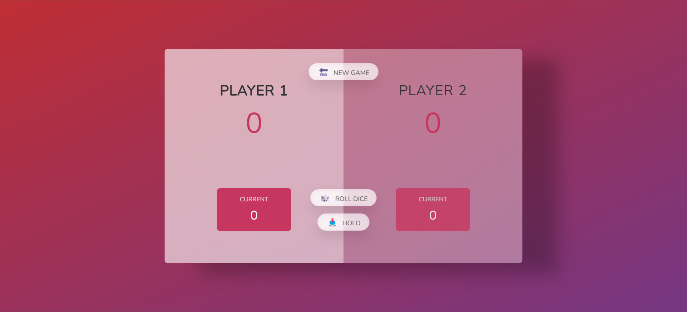
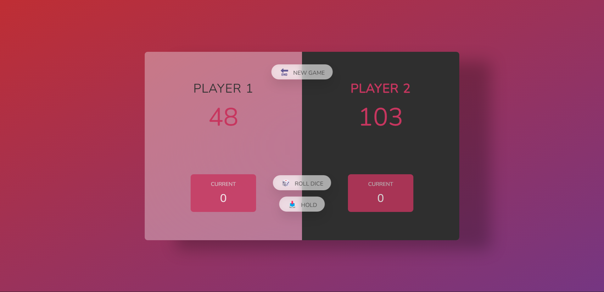

<h1 align="center">Hi 👋, I'm Dariusz</h1>
<h3 align="center">I wanna present you a JavaScript Game🎮 called: </h3>
<h3 align="center"> 🎲 Pig Game! 🎲 </h3>

        

        

        

        <h2 align="left"><b>1. How to install</b></h2>

    <ul>
    <li >Please clone this repository to your folder</li>
    <li> Clone repo to your folder
        You should open a site with live server by using extension called "LiveServer" or use a command in your console:</li>
    <pre>
  <code>
        npm install -g live-server // if you have node. js instaled
  </code>
</pre>
<li>Then type:<pre><code>live-server</code></pre></li>
    </ul>
       

        <h3 align="left"><b>It should work! 👌</b></h3>

    <h2 align="left"><b>2. How to play?</b></h2>
        
<h3><b>Rules:</b></h3>

        <ol>
            <li>Players are playing in turn system</li>
            <li>Acitve player<b>(highlighted)</b> is starting, press a roll button to play. If the number on dice <b>!==1</b> then it will be add tu your current score  
            You can press hold button to end your turn. It save current score to global score and change a player.</li>
            <li>If number on <b>dice == 1</b> then active  player lost his current score and system change the player</li>
            <li> First player who gets a 100 points win (the winner player theme will change to <b> black</b> color) 🥇</li>
        </ol>
        

        

        
        

        

        

        <h3 align="center"><b>Have fun 🥳</b></h3>
        

